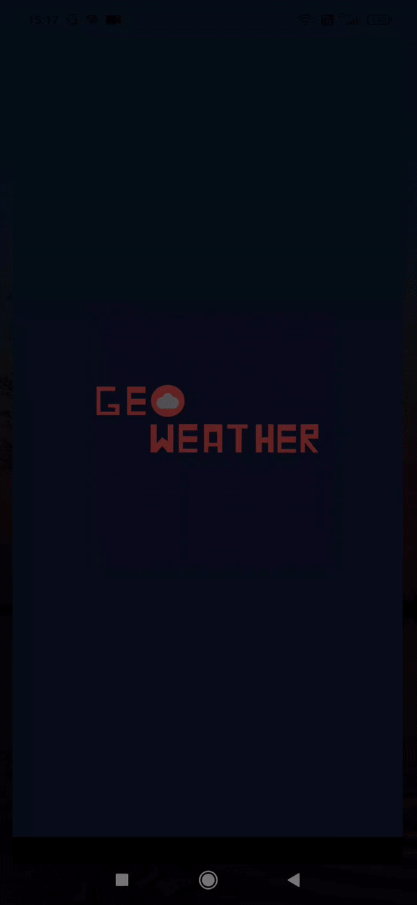

Geo Weather
===
A simple mobile app, that shows your current location, and checks weather.


## Getting Started

You can simply download an [apk file](https://github.com/jmysliv/geo_weather/releases/download/1.0/app.apk) and then install it on your android device.

You can also clone repository and build app yourself. Use the following commands:
```bash
    git clone git@github.com:jmysliv/geo_weather.git
    cd geo_weather
    flutter build apk --split-per-abi
    flutter install
```

## Demo 

